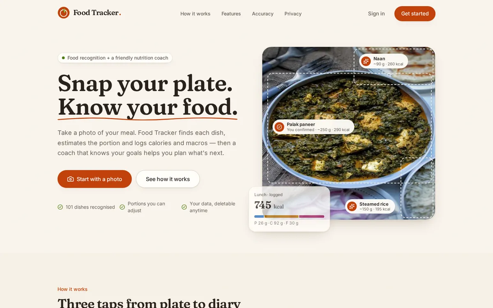
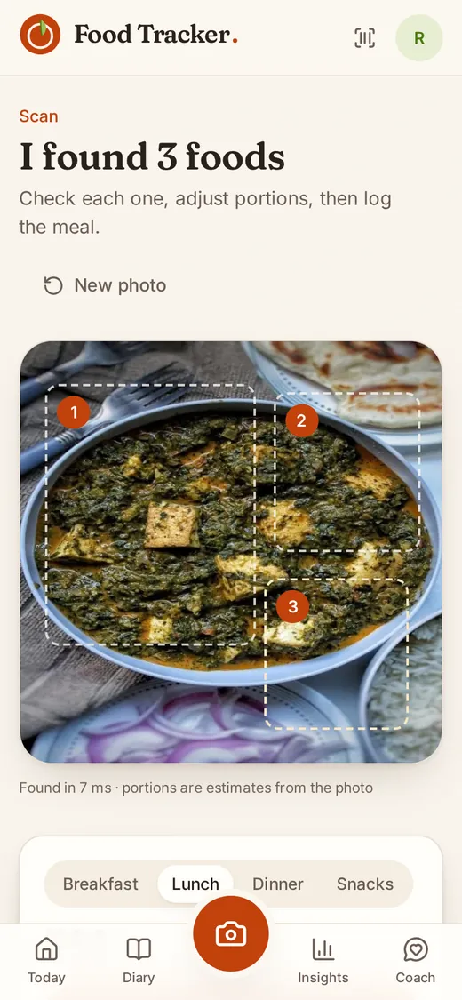
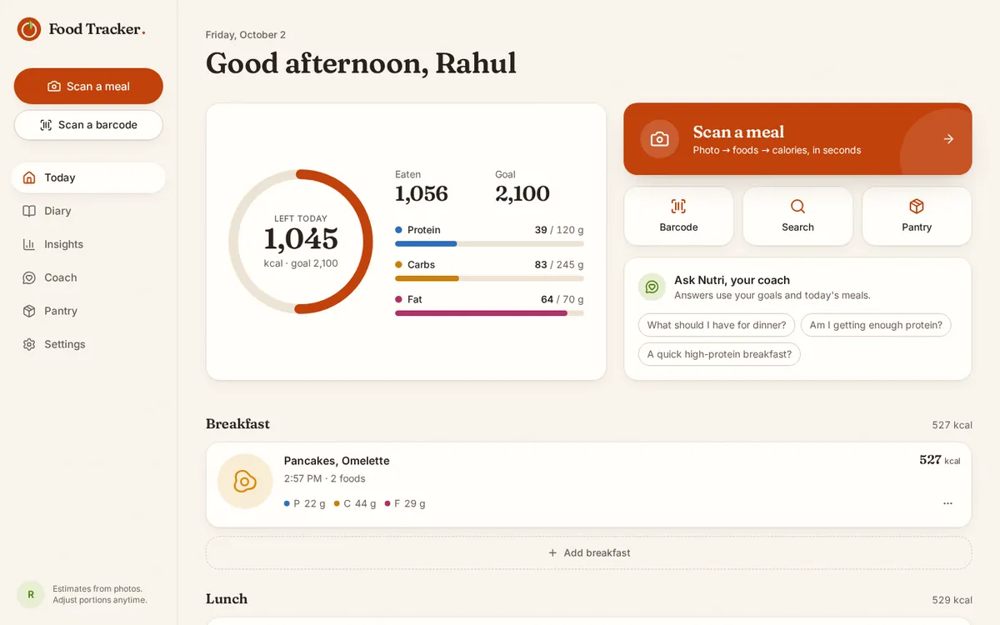
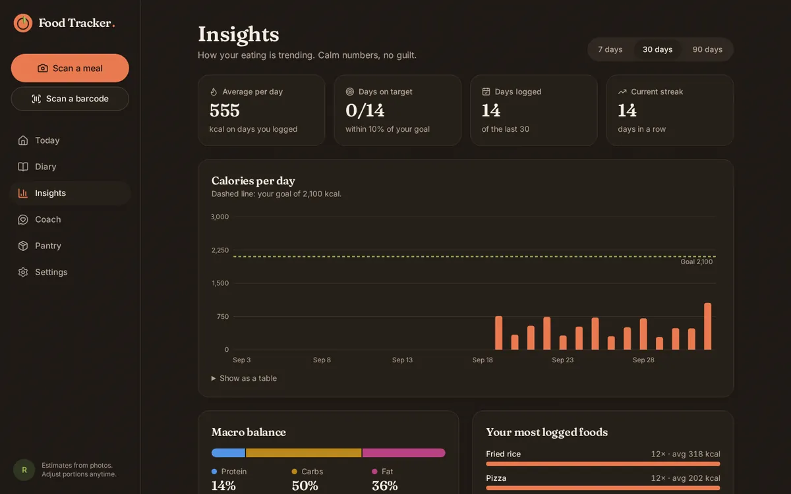

# Food Tracker

**Snap your plate. Know your food.** Take a photo of a meal and the app finds each dish, names
it, estimates the portion and logs the calories and macros. You can also scan a packet's barcode
or search for a food. An AI coach that knows your goals and what you ate helps you plan what's
next.

<p>
  
  
</p>
<p>
  
  
</p>

## Contents

1. [Features](#features)
2. [How it works](#how-it-works)
3. [Tech stack](#tech-stack)
4. [Repository layout](#repository-layout)
5. [Run it on your computer](#run-it-on-your-computer)
6. [Configuration](#configuration)
7. [The models](#the-models)
8. [Put it online](#put-it-online)
9. [See who uses it](#see-who-uses-it)
10. [Tests and CI](#tests-and-ci)
11. [API reference](#api-reference)
12. [Data model](#data-model)
13. [Security and privacy](#security-and-privacy)
14. [Troubleshooting](#troubleshooting)
15. [Design decisions](#design-decisions)
16. [Credits](#credits)

## Features

**Scan a meal**
- Take a photo with the camera, or upload one. Drag-and-drop and paste work too. iPhone HEIC
  photos are supported, and photos are straightened using their EXIF data.
- A detector draws a numbered box around each food on the plate. SigLIP 2 then names each one
  from **200 dishes**: the 101 Food-101 dishes plus 99 Indian and everyday ones.
- Every food shows its **top 3 guesses** with a confidence label. When the model is unsure (below
  50%), the item is flagged for you to confirm, change or search.
- The **portion in grams** is estimated from how much of the photo the food covers. You can
  adjust it with a slider, type a value, or tap ½×, 1×, 1½× or 2×. The macros update as you
  change it.
- You can add something the model missed. The meal type (breakfast, lunch, dinner or snacks) is
  guessed from the time of day.
- After you log the meal, the coach gives a short tip about it.

**Scan a barcode**
- Point the camera at a packet. Chrome on Android and macOS reads it with the browser's built-in
  barcode reader. Other browsers, such as Chrome on Windows, use ZXing, set up to read only
  product barcodes (EAN-13, EAN-8, UPC-A and UPC-E).
- You can also type the number printed under the barcode.
- Product data comes from Open Food Facts: name, brand, photo and Nutri-Score. It shows values
  per serving or per 100 g, with a quantity stepper.

**Track your day**
- **Today:** a calorie ring with what's left, protein, carb and fat bars against your targets,
  today's meals by type, and quick actions.
- **Diary:** a week strip you can page through, and a search across all your meals. You can
  edit a meal's items, portions, type or date, and delete with undo.
- **Insights:** calories against your goal over 7, 30 or 90 days, your average macro split, your
  top foods, a consistency calendar and your weekday pattern.
- **Pantry:** your own foods with their nutrition per serving. You can add, edit, delete,
  favourite and filter them.

**Nutri, the AI coach**
- Chat with Gemini. Replies stream in word by word.
- The coach sees your goal and targets, what you ate today, your last 7 days, and the last 20
  messages of your conversation.
- The conversation is stored on the server, so it continues on any device.
- It is supportive, avoids medical claims and extreme diets, and treats your data as data, not
  as instructions.

**Your account**
- **Onboarding:** set a goal and optional body stats. The app suggests calorie and macro targets
  using the Mifflin-St Jeor formula, and you can edit them.
- **Settings:** profile and goals, units, theme, **export all your data as JSON**, and **delete
  your account** together with all of its data.

**Everywhere**
- Installable as an app on phones (PWA), with light and dark themes.
- Accessible to WCAG 2.2 AA, checked by axe on every screen in the end-to-end tests. Keyboard
  and screen readers are supported, and reduced motion is respected.
- An offline banner, loading screens and friendly error messages.

## How it works

```
Browser: React PWA on Firebase Hosting
  ├─ Firebase Auth ............ sign-in (Google or email) → ID token
  └─ HTTPS + Bearer token ──▶ API: FastAPI (on your computer, or on Cloud Run)
        ├─ scan ............... decode → detect → crop → SigLIP 2 → top 3 → portion → nutrition
        ├─ Firestore .......... profile, meals, pantry, coach messages (only the API can access it)
        ├─ Gemini ............. coach chat (streamed) and the tip after each meal
        ├─ Open Food Facts .... barcodes
        └─ CalorieNinjas ...... free-text food search (cached)
```

**What happens in a scan** (`POST /v1/scan`):
1. **Decode.** The photo is turned upright using its EXIF data, HEIC is converted, and the long
   side is capped at 1280 px. Uploads are limited to 8 MB.
2. **Detect.** Your YOLOv8 model, at 640 × 640, finds up to 10 foods with confidence ≥ 0.25.
   Boxes under 1% of the photo are dropped. With no detector, or when it finds nothing, the whole
   photo is treated as one dish.
3. **Classify.** All the crops go through the SigLIP 2 image encoder in one batch. Each crop is
   compared with a precomputed text embedding for each of the 200 dishes, and the top 3 are kept.
4. **Clean up.** Overlapping boxes that name the same dish are merged, so a dish is never counted
   twice.
5. **Portion.** Grams = the dish's typical serving × (the box's share of the photo ÷ that dish's
   reference share), kept between 0.3× and 3×. Because it uses a share of the photo, the
   estimate doesn't depend on the photo's resolution.
6. **Nutrition.** Values per 100 g come from a bundled table for all 200 dishes, so a scan needs
   no outside service.

**Food search** checks the 200 dishes first, then your pantry. It asks CalorieNinjas only when
there are fewer than 3 good matches.

All models are served with **ONNX Runtime**. There's no TensorFlow or PyTorch in the server, so
it starts in seconds. Each converted model is checked against the original before it is
published.

## Tech stack

| Part | Built with |
|---|---|
| **Web app** | React 19, TypeScript 5.9, Vite 7, React Router 7, TanStack Query 5, Tailwind CSS 4, Radix UI, Motion, Recharts, react-hook-form and zod, sonner, vaul, `vite-plugin-pwa` |
| **API client** | Typed from the API's OpenAPI spec (`openapi-typescript` and `openapi-fetch`), so the web app and the API can't drift apart |
| **API** | Python 3.12, FastAPI, Pydantic 2, Uvicorn, `firebase-admin`, `google-genai`, httpx, Pillow and `pillow-heif`, NumPy, ONNX Runtime, structlog. Managed with uv. |
| **Models** | SigLIP 2 base (`google/siglip2-base-patch16-224`) for naming dishes, your YOLOv8 for finding them, and optionally your EfficientNetV2-B3 |
| **Firebase** | Authentication, Firestore and Hosting. Storage holds meal photos on the Blaze plan. |
| **Outside services** | Google Gemini (coach), Open Food Facts (barcodes), CalorieNinjas (search) |
| **Testing** | pytest, respx, Firebase emulators, Vitest, Testing Library, Playwright with axe |
| **CI/CD** | GitHub Actions: tests on every push, model conversion, model comparison, and a deploy to Cloud Run with keyless sign-in |

## Repository layout

```
api/                 FastAPI service
  app/core/          settings, auth, errors, logging, rate limits
  app/ml/            image decoding, detector, classifiers, pipeline, portions
  app/services/      scan, nutrition and search, barcode, coach, account
  app/repositories/  Firestore and in-memory storage
  app/routers/       the HTTP endpoints (see API reference)
  app/data/          labels.json (200 dishes) and nutrition.json
  models/            model files (downloaded, not in git) and manifest.json (checksums)
  tests/             unit, emulator and real-model tests
web/                 React app
  src/features/      one folder per screen (scan, barcode, today, diary, insights, pantry, coach…)
  src/components/    shared UI
  src/lib/           API client, Firebase, dates, nutrition, images
  e2e/               Playwright end-to-end and accessibility tests
ml/                  model export, parity checks, the model comparison, MODEL_CARD.md
infra/               Firestore and Storage rules, Cloud Run service, bootstrap.sh
scripts/             helper scripts (below)
docs/adr/            design decisions
.github/workflows/   ci.yml, models.yml, compare.yml, deploy.yml
```

| Script | What it does |
|---|---|
| `scripts/dev-stack.sh` | Runs everything locally: Firebase emulators, the API and the web app |
| `scripts/fetch_models.py` | Downloads the model files from the `models-v1` release and verifies their checksums |
| `scripts/serve-public.sh` | Runs the API against your real Firebase project (free setup) |
| `scripts/deploy-hosting.sh` | Builds the website for an API address and deploys it to Firebase Hosting |
| `scripts/smoke.sh` | Quick checks against a running API |
| `scripts/build_nutrition_table.py` | Rebuilds the nutrition table |
| `scripts/migrate_v1_to_v2.py` | One-off move of data from the first version's Firestore layout |

## Run it on your computer

This needs no cloud accounts and no API keys. By default the app uses **demo models** and a
**demo coach**, and the scan screen labels their results as made up.

### 1. Install the tools (once)

The scripts are written for Linux or macOS. **On Windows, use WSL** (Ubuntu):
1. In PowerShell as administrator, run `wsl --install`, then restart.
2. In VS Code, install the **WSL** extension.
3. Click the `><` icon in the bottom-left corner, then **Connect to WSL**.
4. Run everything below in that window's terminal.

| Tool | Version | Install (Ubuntu / WSL) |
|---|---|---|
| uv (installs Python 3.12 itself) | latest | `curl -LsSf https://astral.sh/uv/install.sh \| sh` |
| Node.js | 22 or newer | `curl -o- https://raw.githubusercontent.com/nvm-sh/nvm/v0.40.3/install.sh \| bash`, then `nvm install 22` |
| pnpm | 10 (version pinned in the repo) | `corepack enable` |
| Java (for the Firebase emulators) | 21 | `sudo apt install -y openjdk-21-jre-headless` |
| Firebase CLI | 15 | `npm install -g firebase-tools` |

On macOS, use Homebrew for Java (`brew install openjdk@21`) and the same commands for the rest.

### 2. Get the code and install packages

Clone into your Linux home folder (`~`). On WSL, a folder on `C:` or `D:` is slow, and changes
there don't auto-reload.

```bash
cd ~
git clone https://github.com/Rahulreddy2004/Food-tracker-AI.git
cd Food-tracker-AI
(cd api && uv sync)
(cd web && pnpm install)
```

### 3. Start it

```bash
scripts/dev-stack.sh
```

Open <http://localhost:5173> and sign up with any email and password. These accounts exist
only in the local emulators and are wiped when you stop the app with **Ctrl+C**.

| Service | Address |
|---|---|
| Web app | <http://localhost:5173> |
| API (interactive docs at `/docs`) | <http://127.0.0.1:8000> |
| Firebase emulators: Auth, Firestore, Storage | ports 9099, 8080, 9199 |

### 4. Use the real models, coach and search

```bash
python3 scripts/fetch_models.py        # about 480 MB, verified against api/models/manifest.json
```

Put your own keys in `api/.env`. Git ignores this file, so never put keys anywhere else:
```
GEMINI_API_KEY=your-gemini-key            # https://aistudio.google.com/apikey
CALORIENINJAS_API_KEY=your-calorieninjas-key
```

Then start with both real backends:
```bash
MODEL_BACKEND=onnx LLM_BACKEND=gemini scripts/dev-stack.sh
```

## Configuration

**API settings** (`api/app/core/config.py`) come from environment variables or `api/.env`.
`api/.env.example` lists them with comments.

| Variable | Default | What it does |
|---|---|---|
| `ENV` | `development` | `production` hides `/docs` and refuses demo backends |
| `MODEL_BACKEND` | `onnx` | `onnx` for the real models, `fake` for the demo models (`dev-stack.sh` defaults to `fake`) |
| `CLASSIFIER` | `siglip2` | `siglip2` for 200 dishes, or `efficientnet` for your Food-101 model (101 dishes) |
| `DETECTOR_FILE` | `best.onnx` | Your detector in `api/models/`. Without it, each photo is one dish. |
| `DETECTOR_REQUIRED` | `false` | When `true`, the API refuses to start without the detector |
| `CONFIRM_BELOW` | `0.50` | Guesses below this confidence ask the user to confirm |
| `ONNX_THREADS` | `2` | CPU threads per model |
| `MAX_UPLOAD_MB` | `8` | Largest photo accepted |
| `DATA_BACKEND` | `firestore` | `firestore`, or `memory` (lost on restart, for tests) |
| `FIREBASE_PROJECT_ID` | none | Your Firebase project, e.g. `food-tracker-8baa9` |
| `STORAGE_BUCKET` | none | The bucket for meal photos (Blaze only). Empty turns photos off. |
| `GOOGLE_APPLICATION_CREDENTIALS` | none | Path to a service-account key, needed when the API runs outside Google Cloud |
| `LLM_BACKEND` | `gemini` | `gemini`, or `fake` for canned replies |
| `GEMINI_API_KEY` / `GEMINI_MODEL` | none / `gemini-3.6-flash` | Coach key and model ([current models](https://ai.google.dev/gemini-api/docs/models)) |
| `CALORIENINJAS_API_KEY` | none | Free-text food search |
| `CORS_ORIGINS` | localhost:5173 | Comma-separated websites allowed to call the API |
| `LOG_JSON` | `false` | One JSON line per request; useful for usage reports |
| `RATE_SCAN_PER_MIN` / `RATE_COACH_PER_MIN` / `RATE_SEARCH_PER_MIN` | 30 / 20 / 120 | Per-user limits |

**Web settings** (`web/.env.example`) are read at build time:

| Variable | What it does |
|---|---|
| `VITE_API_URL` | The API's address. `deploy-hosting.sh` sets it for you. |
| `VITE_FIREBASE_*` | Firebase web config. Not needed on Firebase Hosting, which serves it at `/__/firebase/init.json`. |
| `VITE_FIREBASE_AUTH_EMULATOR`, `VITE_FIREBASE_STORAGE_EMULATOR` | Use the local emulators (`dev-stack.sh` sets them) |

## The models

| | Names the dish (served) | Finds each dish (optional) | Your classifier (optional) |
|---|---|---|---|
| Model | SigLIP 2 base, zero-shot (Apache-2.0) | Your YOLOv8m `best.pt`, trained on 102 dishes | Your EfficientNetV2-B3 `.h5` |
| Served as | `siglip2_vision.onnx` (373 MB) and `siglip2_dishes.npz` | `best.onnx` (104 MB) | `classifier.onnx`, with `CLASSIFIER=efficientnet` |
| Job | Picks the dish among 200 for each box | Draws a box around each food | Picks among the 101 Food-101 dishes |

The detector only draws boxes; SigLIP 2 names what's in each one. That's why the detector's own
102 class names don't need to match the 200 dishes.

**Accuracy.** The **Compare models** workflow measured it on photos none of the models trained
on:

| | Food-101 (2,020 photos) | Indian-20 (941 photos) |
|---|---|---|
| **SigLIP 2 base, zero-shot over 200 dishes (served)** | **90.5%** | **84.3%** |
| Best model fine-tuned on Food-101 only | 91.4% | 17.2% |

Models trained only on Food-101 can name just 4 of the 20 Indian dishes. Details, the
confidence-vs-accuracy table and the honest limits are in [`ml/MODEL_CARD.md`](ml/MODEL_CARD.md).
In short:
- Look-alike dishes get confused.
- A dish outside the 200 gets the closest name, with low confidence.
- A single photo can't measure depth, so every portion is an editable estimate.

**Where the files live.** The model files are on the GitHub Release
[`models-v1`](https://github.com/Rahulreddy2004/Food-tracker-AI/releases/tag/models-v1), not in
git. `scripts/fetch_models.py` checks every download against `api/models/manifest.json`, or the
release's `SHA256SUMS`. Deploys run it with `--strict`, which refuses any file it can't verify.

**Replace the detector with a better `best.pt`:**
1. On the release page, click **Edit**. Delete the old `best.pt`, attach the new one (the name
   must be exactly `best.pt`), then click **Update release**.
2. Run **Actions → Models → Run workflow**, keeping "SigLIP 2 files" on **keep them**. It
   converts the model, checks that the ONNX version finds the same boxes as the original, lists
   the detector's classes and publishes `best.onnx`.
3. Run `python3 scripts/fetch_models.py` and restart the API. With Cloud Run, run **Deploy**
   instead.

To compare your EfficientNet with SigLIP 2, attach `food101_EfficientNetV2B3_final.h5` and run
**Models** again. **Adding a dish** needs no retraining: add it to `api/app/data/labels.json`,
`api/app/data/nutrition.json` and `ml/vocab/extra_dishes.json`. Then rebuild SigLIP 2 with
**Models** → **rebuild and republish**, and copy the new checksums into the manifest.

## Put it online

There are two ways. Both put the website on Firebase Hosting, at
`https://<project-id>.web.app`.

| | A. Free (Spark plan) | B. Cloud (Blaze plan) |
|---|---|---|
| Where the API runs | Your computer, through Tailscale Funnel | Google Cloud Run, which scales to zero |
| Cost | Free | Pay as you go. Light use stays within the free allowance. |
| Online when | Your computer, the API and the tunnel are running | Always |
| Meal photos | Off (Storage needs Blaze) | On |
| Deploys | You run `scripts/deploy-hosting.sh` | Automatic on every push to `main` |

### A. Free setup (Spark plan)

**One-time setup**
1. **Firebase console** → Authentication → Sign-in method: enable **Email/Password** and
   **Google**.
2. **Service-account key:** Project settings → Service accounts → **Generate new private key**.
   Then:
   ```bash
   mkdir -p ~/.secrets
   mv /mnt/c/Users/<you>/Downloads/<project>-firebase-adminsdk-*.json ~/.secrets/food-tracker-sa.json
   chmod 600 ~/.secrets/food-tracker-sa.json
   ```
   This key gives full access to your project. Never commit, upload or share it.
3. **Tailscale:** install it from <https://tailscale.com/download> and sign in. On Windows,
   install it on Windows, not inside WSL; Windows forwards `localhost` to WSL. Then run this
   once in PowerShell:
   ```powershell
   tailscale funnel --bg 8000
   ```
   The first time, it prints a link to turn Funnel on. It then prints your permanent address,
   e.g. `https://my-pc.tail1234.ts.net`.
4. **Deploy tools:**
   ```bash
   npx firebase-tools@15 login --no-localhost
   (cd web && pnpm exec playwright install --with-deps chromium)   # browser that pre-renders the landing page
   ```
   Playwright 1.56 doesn't support Ubuntu 26.04 yet. On 26.04, install Chrome's libraries and the
   Ubuntu 24.04 build instead:
   ```bash
   sudo apt-get install -y libasound2t64 libatk-bridge2.0-0t64 libatk1.0-0t64 libatspi2.0-0t64 \
     libcairo2 libcups2t64 libdbus-1-3 libdrm2 libgbm1 libglib2.0-0t64 libnspr4 libnss3 \
     libpango-1.0-0 libx11-6 libxcb1 libxcomposite1 libxdamage1 libxext6 libxfixes3 \
     libxkbcommon0 libxrandr2
   (cd web && PLAYWRIGHT_HOST_PLATFORM_OVERRIDE=ubuntu24.04-x64 pnpm exec playwright install chromium)
   ```

**Every time you want the app online**, run this and keep the terminal open:
```bash
cd ~/Food-tracker-AI
GOOGLE_APPLICATION_CREDENTIALS=~/.secrets/food-tracker-sa.json scripts/serve-public.sh
```

**To deploy the website** (the first time, and after changes to the web app), run this in a
second terminal while the API is running:
```bash
scripts/deploy-hosting.sh https://my-pc.tail1234.ts.net
# on Ubuntu 26.04:
PLAYWRIGHT_HOST_PLATFORM_OVERRIDE=ubuntu24.04-x64 scripts/deploy-hosting.sh https://my-pc.tail1234.ts.net
```
It does the following:
1. Checks that the API answers at that address.
2. Builds the website for it, and allows only that address in the site's security policy.
3. Deploys Hosting and the Firestore rules and indexes.
4. Checks the live site.

### B. Cloud setup (Blaze plan)

Deploys run from GitHub Actions. They sign in to Google Cloud with **Workload Identity
Federation**, so no service-account key is stored anywhere.

1. In the Firebase console:
   - upgrade to **Blaze**, and set a budget alert
   - enable **Storage**
   - enable **Google** and **Email/Password** sign-in
2. Install the [gcloud CLI](https://cloud.google.com/sdk/docs/install) and run the one-time
   setup with your own account:
   ```bash
   gcloud auth login
   infra/bootstrap.sh
   ```
   - It enables the APIs, and creates the image registry and two service accounts with only the
     permissions they need.
   - It asks for your Gemini and CalorieNinjas keys without showing them, and stores them in
     Secret Manager.
   - It's safe to run again.
3. Add the four repository **variables** it prints: GitHub → Settings → Secrets and variables
   → Actions → **Variables**.
4. Run **Actions → Deploy → Run workflow**. After that, every push to `main` deploys by itself.
   Each deploy:
   1. builds the server image with the verified models
   2. deploys it to Cloud Run and smoke-tests it
   3. builds the website with a security policy that allows only that API
   4. deploys Hosting with the Firestore and Storage rules
   5. checks the live site

To move from A to B, nothing needs undoing. Stop the tunnel with `tailscale funnel reset`.

## See who uses it

- **Accounts:** Firebase console → **Authentication → Users**. It shows each person's email,
  sign-in method, sign-up date, last sign-in and **User UID**.
- **Their data:** **Firestore → Data → `users` → a UID**, with their profile, `meals`, `pantry`
  and `coachMessages`.
- **Daily load:** **Firestore → Usage** shows reads and writes against the free plan's 50,000
  reads and 20,000 writes per day.
- **Activity over time** (free setup): start the API with JSON logs saved to a file:
  ```bash
  LOG_JSON=true GOOGLE_APPLICATION_CREDENTIALS=~/.secrets/food-tracker-sa.json \
    scripts/serve-public.sh 2>&1 | tee -a ~/food-tracker-api.log
  ```
  Each request is one line with its time, `uid`, `method`, `path`, `status` and duration in ms.
  Match the `uid` with the User UID column in Authentication.
- **Outside services:** Google AI Studio shows Gemini usage, and your CalorieNinjas account page
  shows the calls you've used this month.

The logs and Firestore hold your users' personal data, so keep them private.

## Tests and CI

| What | Command |
|---|---|
| API lint, types, unit tests | `cd api && uv run ruff check app tests && uv run mypy app && uv run pytest` |
| API against the emulators | `firebase emulators:exec --project demo-foodtracker --only auth,firestore "cd api && FIREBASE_PROJECT_ID=demo-foodtracker uv run pytest -m emulator"` |
| API with the real models | `cd api && uv run pytest -m models` |
| Web lint, types, unit tests | `cd web && pnpm lint && pnpm typecheck && pnpm test` |
| Web build, size budget, CSP check | `cd web && pnpm build && pnpm size` |
| End-to-end and accessibility (starts the stack) | `cd web && pnpm exec playwright install chromium && pnpm e2e` |
| A running API | `scripts/smoke.sh <url>` |

**GitHub Actions**

| Workflow | When it runs | What it does |
|---|---|---|
| **CI** | Every push and pull request | The commands above, a gitleaks secret scan, dependency audits, and a build and boot of the production image |
| **Models** | By hand | Converts and checks your detector and classifier. Builds SigLIP 2 only when asked. |
| **Compare models** | By hand | Scores model candidates on Food-101 and Indian-20 |
| **Deploy** | Pushes to `main` (Blaze setup only) | Cloud Run and Hosting. Skipped until `bootstrap.sh`'s variables exist. |

## API reference

Every route is under `/v1`, and all of them except health need `Authorization: Bearer <Firebase
ID token>`. Errors use one format (`application/problem+json`) with a stable `code`. Interactive
docs are at `/docs` when `ENV` isn't `production`.

| Method and path | What it does |
|---|---|
| `GET /health/live`, `GET /health/ready` | Liveness; readiness (models loaded, coach configured) |
| `POST /scan` | Photo in (multipart, ≤ 8 MB). Out: items with boxes, top-3 guesses, grams, nutrition, timings, model info. |
| `GET /foods/search?q=` | Dishes, then your pantry, then CalorieNinjas |
| `GET /barcode/{code}` | A packaged food from Open Food Facts |
| `GET /meals?from=&to=`, `POST /meals` | List meals in a date range; log a meal |
| `GET`, `PATCH`, `DELETE /meals/{id}` | Read, edit or delete one meal |
| `GET /summary/daily?from=&to=` | Totals per day, for the charts |
| `GET /pantry`, `POST /pantry`, `PATCH`, `DELETE /pantry/{id}` | Your custom foods |
| `GET /me/profile`, `PUT /me/profile` | Goals, targets, body stats, units, timezone |
| `GET /me/export`, `DELETE /me` | Download all your data; delete your account and all its data |
| `POST /coach/messages` | Send a message. The reply streams back as Server-Sent Events. |
| `GET /coach/thread`, `DELETE /coach/thread` | Read or clear your conversation |
| `POST /coach/meal-insight` | A short tip about a logged meal |

The web app's types are generated from this API: run `pnpm api:types` in `web/`.

## Data model

```
users/{uid}                     profile: displayName, goal, targets {kcal, proteinG, fatG, carbsG},
                                body stats, units, timezone, onboarded
users/{uid}/meals/{id}          localDate, mealType, eatenAt, source (scan | barcode | pantry | search | manual),
                                items [name, grams, nutrition, confidence, box…], totals, photoPath
users/{uid}/pantry/{id}         your foods: name, serving, nutrition, favourite
users/{uid}/coachMessages/{id}  role, text, createdAt
Storage: users/{uid}/meals/*.webp   meal thumbnails (Blaze only)
```

Meals are filed by `localDate`, the date in the user's own timezone, so a late dinner counts on
the right day.

## Security and privacy

- **Database:** Firestore is closed to browsers by its rules. Only the API reads and writes, and
  only for the signed-in user.
- **Photos:** in Storage, each user can reach only their own `users/{uid}/meals/*` images, under
  2 MB.
- **Sign-in:** every API route except health checks the Firebase ID token. Per-user rate limits
  apply.
- **The website's security headers:**
  - a strict Content Security Policy: no `eval`, no inline scripts except one hash-pinned theme
    snippet, and network calls only to the API and Google
  - HSTS
  - camera-only Permissions-Policy

  `pnpm build` fails if an inline script isn't allowed.
- **Secrets:**
  - Never in git. CI and pre-commit run gitleaks.
  - Locally, they live in `api/.env` and `~/.secrets/`.
  - On Cloud Run, they live in Secret Manager.
  - The Cloud deploy uses keyless sign-in, limited to this repository's `main` branch.
- **Your data:** users can export everything, or delete their account and all of its data, from
  Settings.

## Troubleshooting

| Problem | Fix |
|---|---|
| Every photo gives the same dishes (Pizza 82%…) and a **"Demo models"** note | You're on the demo models. Run `python3 scripts/fetch_models.py`, then start with `MODEL_BACKEND=onnx`. |
| `Port … already in use` | Another copy is running. `dev-stack.sh` and `serve-public.sh` both use port 8000, so stop one with Ctrl+C. |
| `502` from your `ts.net` address | The API isn't running, or Windows can't reach it. Check `curl http://127.0.0.1:8000/v1/health/ready` in WSL, and `curl.exe` the same address in PowerShell. |
| `Playwright does not support chromium on ubuntu26.04` | Use the Ubuntu 26.04 commands in step 4 of the free setup |
| The coach says the model isn't found | Set `GEMINI_MODEL` in `api/.env` to a current model from Google AI Studio |
| The emulators won't start | Install Java 21 (`java -version` should print 21) |
| Blank page or `504 Outdated Optimize Dep` while developing | Stop the app, run `rm -rf web/node_modules/.vite`, then start again |
| The barcode won't read on a laptop | Hold the packet flat about 20 cm from the camera in good light, or type the number under the barcode |
| The first scan on Cloud Run is slow | The server was asleep. It wakes and loads the models in about 10–20 s, and then it's fast. |

## Design decisions

Short write-ups in [`docs/adr/`](docs/adr):
1. [Architecture](docs/adr/0001-architecture.md): FastAPI, Vite and React, keeping Firebase
2. [Serving the models with ONNX Runtime](docs/adr/0002-onnx-serving.md)
3. [Resolution-independent portion estimates](docs/adr/0003-portion-estimation.md)
4. [SigLIP 2 as the classifier](docs/adr/0004-open-vocabulary-classifier.md): open vocabulary,
   200 dishes

## Credits

- [SigLIP 2](https://huggingface.co/google/siglip2-base-patch16-224) by Google (Apache-2.0)
- [Ultralytics YOLOv8](https://github.com/ultralytics/ultralytics) (AGPL-3.0)
- The [Food-101](https://data.vision.ee.ethz.ch/cvl/datasets_extra/food-101/) dataset (ETH
  Zurich)
- [Open Food Facts](https://world.openfoodfacts.org) product data (ODbL)
- [ZXing](https://github.com/zxing-js/library) barcode reading (Apache-2.0)
- [CalorieNinjas](https://calorieninjas.com) for food search
- [Google Gemini](https://ai.google.dev) for the coach
- [Firebase](https://firebase.google.com) for sign-in, the database and hosting
